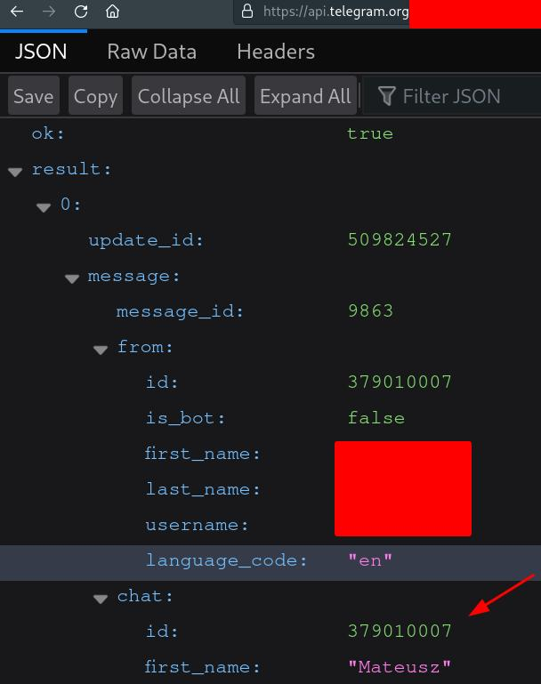

# `tnb` - Telegram Notification Bot

[](https://deps.rs/repo/github/wint3rmute/tnb)


## Usage

`$ some_command | tnb` - will send the output of the command to your
[Telegram](https://telegram.org/) conversation of choice.

Useful for streaming the output of long-running commands, when you don't
want/can't keep a constant SSH connection or you only need a notification when
something finishes.


## Installation

### Arch-based distros

[`tnb`](https://aur.archlinux.org/packages/tnb) package on the AUR.

### Others

Run `cargo build --release`, then copy the resulting binary (at
`./target/release/tnb`) to some folder in your PATH.

## Configuration

Run `tnb` after installation to create a config file

```bash
$ tnb
Creating a new config file at /home/wint3rmute/.config/tnb.json
```

You'll have to fill the `token` and `chat_id` fields in the configuration file
for your bot to work.

### Bot token

Text [BotFather](https://telegram.me/botfather) on Telegram in order to create
a bot and obtain a bot token.

### Chat ID

Once you've obtained the bot token, you can check the Chat ID by sending a
message to your bot and then opening
`https://api.telegram.org/bot<BOT_TOKEN_HERE>/getUpdates?offset=-1` in your
browser.



*Note:* You can either text a bot directly or add it into a conversation/group.
Refer to [Telegram Bot API](https://core.telegram.org/bots/api) for more
information.
